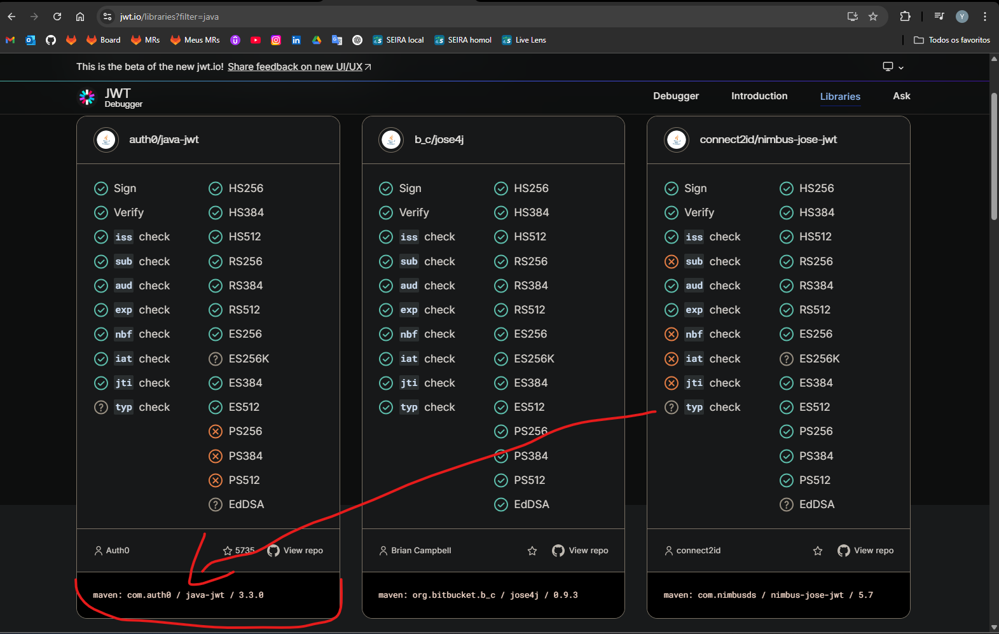

## JWT

Para usar o JWT precisamos instalar a biblioteca. Isso é possível em: [JWT.IO Libraries](https://jwt.io/libraries)

podemos escolher a **com.auth0** 

> 
> Podemos acessar o link do repositório no GitHub e pegar o xml da dependencia Maven

